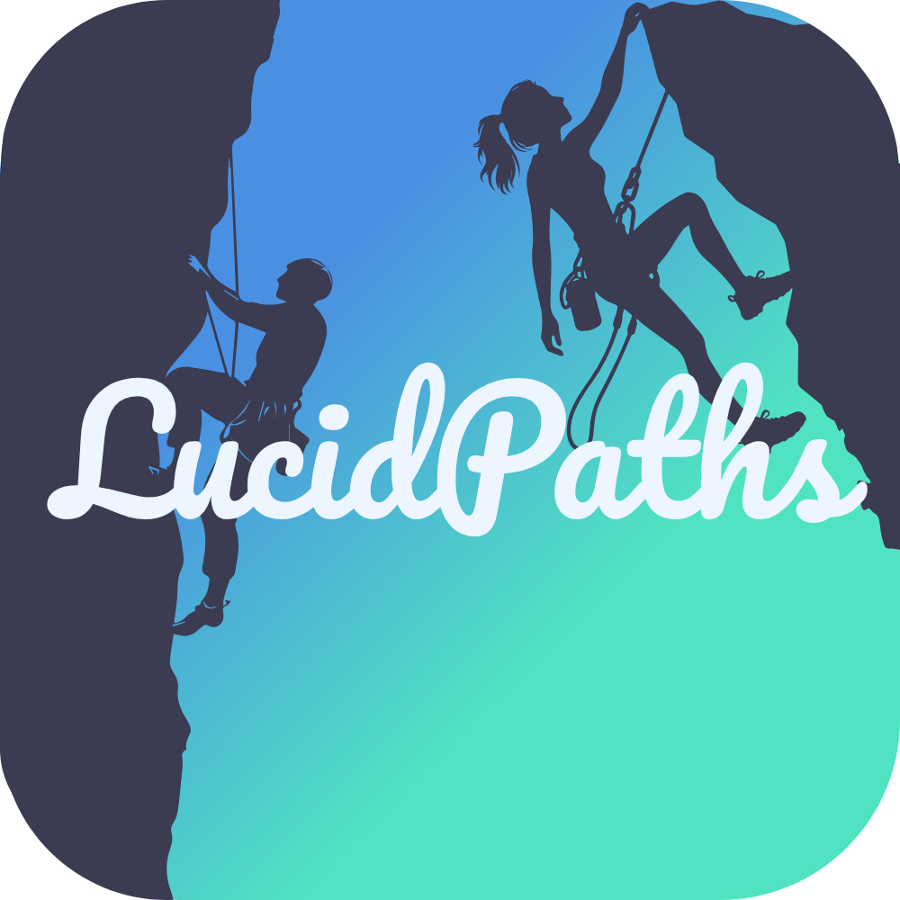

<p align="center">
  
</p>

# 🌿 LucidPaths | Goals & Habits Coach

> Set clear goals, break them into actionable tasks, tag and relate everything, and build sustainable habits — backed by Appwrite.

---

## 📸 Preview

Coming soon…

<!-- Add screenshots or a short GIF when ready -->
<!--  -->

---

## 📚 Progress Tracker

### 1) 🎯 Goals, Tasks & Tags
- [x] **Goals** (title, `successCriteria`, `targetDate`, status)
- [x] **Tasks** with goal linkage
- [x] **Task Dependencies** (`finish_to_start`, optional `lagMinutes`)
- [x] **Tags** (global per user)
- [x] **Many-to-many joins**: `task_tags` and `goal_tags`
- [ ] **Time Logs** (capture effort & history in `time_logs`)

---

### 2) 🔐 Authentication
- [x] Email / Password sign up & sign in (Appwrite)
- [x] Session check & helpful console logs (`logSession`)
- [x] Global auth helpers (`signIn`, `signOut`, `refresh`)
- [ ] Social logins (GitHub/Google/etc.)

---

### 3) 🧭 Navigation & Onboarding
- [x] `expo-router` navigation
- [x] **Welcome → Login/Signup** flows
- [x] **Onboarding (4 steps)** stored in **Profiles** collection  
  - Step 1: Profile basics (name, language, pronouns, country)  
  - Step 2: Barriers (multi-select enum)  
  - Step 3: Time spent / time goal / reminder frequency (enums)  
  - Step 4: Finish → sets `onboardingCompleted = true`
- [x] Routing **gates** using `Profiles.onboardingCompleted` (not auth prefs)
- [x] Custom headers/back buttons (no default headers bleed-through)
- [ ] Deep linking

---

### 4) 🗄️ Appwrite Data Model (suggested)
**Database:** `DB_ID`

**Collections & key attributes**
- `profiles`
  - `ownerId` (string, required, indexed)
  - `email` (string)
  - `name` (string)
  - `language` (string; ISO code like `en`, `es`, …)
  - `pronouns` (enum: `she/her`, `he/him`, `they/them`, `other`)
  - `country` (string; ISO like `us`, `gb`, …)
  - `timeSpentMonthly` (enum: `lt1`, `1-5`, `5-10`, `10+`)
  - `timeGoalMonthly` (enum: `1-5`, `5-10`, `10-20`, `20+`)
  - `reminderFrequency` (enum: `daily`, `fewDays`, `weekly`, `monthly`)
  - `barriers` (enum[], codes: `LM`, `TMI`, `FOF`, `LOCG`, `P`, `SD`, `D`, `O`)
  - `onboardingCompleted` (boolean)
- `goals`
  - `ownerId` (string, required)
  - `title` (string, required)
  - `successCriteria` (string, required)
  - `targetDate` (datetime ISO8601)
  - `status` (string; e.g. `active`, `done`, `archived`)
- `tasks`
  - `ownerId` (string, required)
  - `title` (string, required)
  - `status` (string; e.g. `todo`, `doing`, `done`)
  - `goal` (relationship to `goals`) and/or `goalId` (shadow string for indexing)
- `task_dependencies` (`deps`)
  - `ownerId` (string, required)
  - `task` / `taskId` (downstream)
  - `dependsOn` / `dependsOnId` (upstream)
  - `type` (enum: `finish_to_start`)
  - `lagMinutes` (int)
- `tags`
  - `ownerId` (string, required)
  - `name` (string, unique per owner)
- `task_tags`
  - `ownerId` (string, required)
  - `task` / `taskId`
  - `tag` / `tagId`
- `goal_tags`
  - `ownerId` (string, required)
  - `goal` / `goalId`
  - `tag` / `tagId`
- `time_logs` *(optional / planned)*
  - `ownerId`, `taskId`, `minutes`, `note`, timestamps

**Permissions**
- Collection-level: allow **Users** to **create/read/update/delete**
- Document-level: set with `ownerPerms(userId)` so only the owner can access

---

## 🧠 Vision

- Turn **clarity** into **consistent action**  
- Build **momentum** with lightweight tracking and reminders  
- Keep structure flexible: tags, dependencies, and goal criteria that fit you  
- Make onboarding meaningful — preferences personalize the experience

---

## 🛠️ Tech Stack

- ⚛️ **React Native** (Expo)
- 🧭 **expo-router**
- 🗄️ **Appwrite** (Auth + Database)
- 🎚️ `react-native-dropdown-picker`
- 🌈 `expo-linear-gradient`
- 🅰️ `@expo-google-fonts` (Pacifico, Oswald, Open Sans)
- 🔤 `react-native-vector-icons`

---

## 🚀 Getting Started

### 1) Clone & Install
```bash
git clone https://github.com/<you>/lucid-paths.git
cd lucid-paths
npm install
